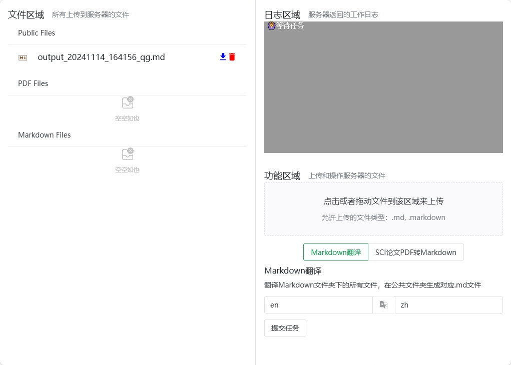

# SCI_TOOLS

这是我自用的工具集合，包括一个SCI pdf文件批量转markdown工具和一个markdown文件批量翻译工具。前端使用 vue.js 构建，后端使用 flask 构建。后端是一个简单的 REST API，用于为前端提供服务并进行计算。



## Usage

first clone the repository
```bash
git clone https://github.com/Riceneeder/sci_tools.git
```

then build the frontend, output will be in `sci_tools/web`
```bash
cd sci_tools/vue
yarn install && yarn build
```

run the python server in the root directory, the server will be running on `0.0.0.0:5000` by default
```bash
pip install -r requirements.txt
gunicorn --worker-class eventlet -w 1 app:app -b 0.0.0.0:5000
```

## Use with docker (optional), recommend using podman

```bash
podman build -t sci_tools .
podman run -p 5000:5000 sci_tools
```


